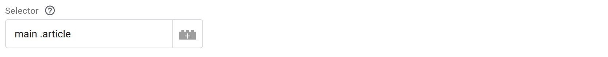
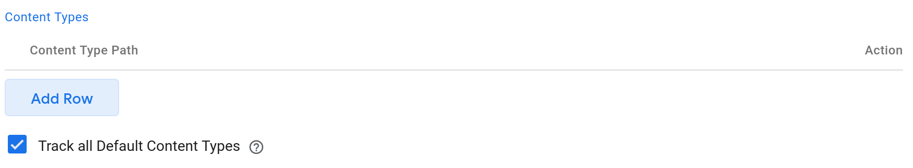
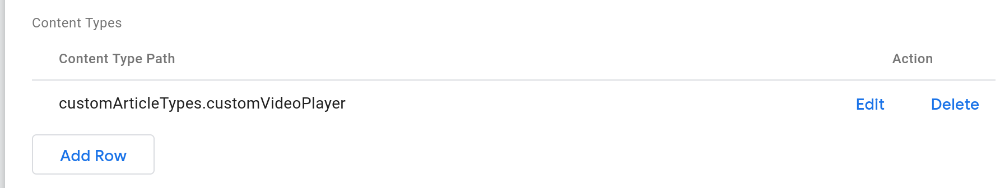
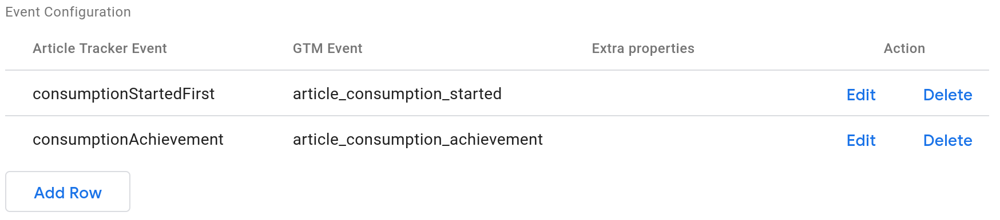

# Article Tracker GTM Template 

> Track your multimedia articles with ease

* [Configuration](#user-content-configuration)
  * [Selector](#user-content-selector)
  * [Content Types](#user-content-content-types)
    * [Custom Content Type Provider](#user-content-custom-content-type-provider)
  * [Event Bindings](#user-content-event-bindings)
    * [Event Binding Example](#user-content-event-binding-example)
  * [Extra Properties](#user-content-extra-properties)
    * [Extra Properties Example](#user-content-extra-properties-example)

## Developing

⚠⚠⚠ The content of this repository is auto-generated from
[@optimics/analytics](https://github.com/optimics/analytics) multirepo, because
Google Tag Manager does not have it's own artifact repository. The contents are
overwritten with each release.

## Workflow

The template has inline documentation, so please refer to it, while configuring
it. 

### Selector

Set up the article selector, which points to element containing the entire
article content, including videos and main headings.



### Content Types

Generally, you want to "Track all Default Content Types", unless you have
created your custom replacement trackers for each Content Type. You can provide
your custom Content Type providers by defining a function, that returns a class
extending the
[ArticleElement](https://github.com/optimics/analytics/tree/master/browser/article-tracker)
or one of it's subclasses.



#### Custom Content Type Provider

```
window.customArticleTypes = {
  customVideoPlayer({ ArticleElement, ArticleParagraph, VisualArticleElement }) {
    return class CustomVideoPlayer extends ArticleElement {
      static selector = '.what-the-player'

      constructor(el) {
        super(el)
        this.subscribeToMyPlayer()
      }

      getMetadata () {
        return JSON.parse(this.el.dataset.metadata)
      }

      estimateFastestTime() {
        return this.getMetadata().totalTime * 0.76
      }

      estimateSlowestTime() {
        return this.getMetadata().totalTime
      }

      subscribeToMyPlayer() {
        magicPlayer.on('play', () => this.recordConsumptionTime())
        magicPlayer.on('pause', () => this.stopConsumption())
      }
    }
  }
}
```



### Event Bindings

Article Tracker produces a [lot of
events](https://github.com/optimics/analytics/tree/master/browser/article-tracker#user-content-events),
so you must choose, which ones you want to track in your datalayer by pairing
the Article Tracker Event Name with the desired data layer event name. 



#### Event Binding Example

```
Article Tracker Event: consumptionStartedFirst
GTM Event: article_consumption_started
```

Extra properties can be bundled with each event binding. See the
[Extra properties](#extraproperties) for examples.

For example:

### Extra Properties

Extra properties will be appended to each event triggered by Article Tracker.
They must be JSON encoded. Invalid JSON inputs will crash the code. GTM
Template Tags may be used in the JSON.

#### Extra Properties Example

```
{"pageTitle": "{{PAGE TITLE VARIABLE}}", "staticVariable": true}
```
